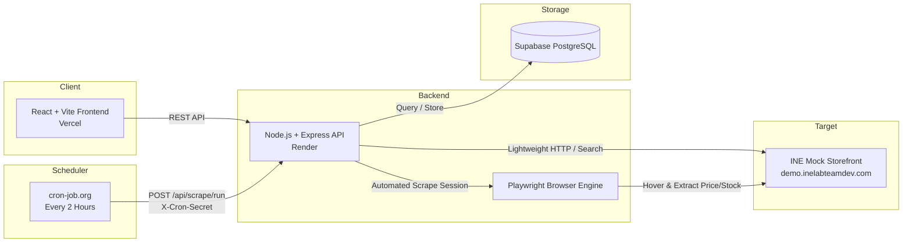

# INE Store Product Price Tracker

A production-ready full-stack web application that tracks product prices and stock availability from the [INE Mock Store](https://demo.inelabteamdev.com/) on an automated schedule with resilient Playwright web scraping, audit logging, and price history analytics.

---

## 🚀 Live Demo & Links

- **Frontend (Vercel):** [https://ine-assignment.vercel.app](https://ine-assignment.vercel.app) *(or your deployed Vercel URL)*
- **Backend (Render):** [https://ine-tracker-backend.onrender.com](https://ine-tracker-backend.onrender.com) *(or your deployed Render URL)*
- **Target Mock Store:** [https://demo.inelabteamdev.com](https://demo.inelabteamdev.com)
- **GitHub Repository:** [https://github.com/Mitanshu4529/INE](https://github.com/Mitanshu4529/INE)
- **Design & Reliability Note:** [docs/design-note.md](docs/design-note.md)

---

## 📋 Features

- 🔍 **Product Search & Discovery:** Search the INE mock store catalog by partial or full product name and select items for tracking.
- ⚡ **Resilient Web Scraping:** Playwright-driven automation that handles anti-bot mouse hover challenges, dwell-time gating, rotating CSS class names, flaky click handlers, and decoy DOM elements.
- ⏱️ **Automated Scheduled Scraping (Every 2 Hours):** External cron trigger via `cron-job.org` calling a secure backend endpoint (`POST /api/scrape/run`) to overcome free-tier backend sleep cycles.
- 📊 **Price & Stock History:** Interactive price trend chart and tabular log of historic price and inventory changes over time.
- 📝 **Honest Scrape Audit Logs:** Comprehensive per-product logs recording all scrape attempts with exact timestamps, status (`SUCCESS`, `RETRYING`, `FAILED`), duration in ms, and error reasons.
- 👁️ **Observable Headed Mode:** Built-in scripts to watch and record the scraper in action in a visible browser with simulated real-world conditions (slow network, errors, retries).
- 🛡️ **Data Integrity Guardrails:** Failures never overwrite or corrupt existing price/stock data.

---

## 🏗️ Architecture & Tech Stack



- **Frontend:** React.js, Vite, TailwindCSS, Chart.js / Lucide icons (Deployed on **Vercel**)
- **Backend:** Node.js (ES Modules), Express.js (Deployed on **Render**)
- **Scraping Engine:** Playwright Chromium with human-like motion interpolation and computed style extraction
- **Database:** Supabase (PostgreSQL) with Row Level Security (RLS) and cascading audit tables
- **Scheduler:** `cron-job.org` external webhook caller

---

## ⏰ Scraping Schedule & Workflow

Because free-tier host instances sleep when idle, scheduled scraping is driven by an external heartbeat rather than an internal background loop:

1. **Schedule:** Every 2 hours (`0 */2 * * *`)
2. **Trigger Method:** `POST https://<backend-host>/api/scrape/run`
3. **Authentication:** Request header `X-Cron-Secret: <CRON_SECRET>`
4. **Execution Flow:**
   - Wakes up the Render instance if asleep.
   - Fetches all active tracked products from Supabase.
   - Sequentially scrapes each product using Playwright.
   - Logs every attempt status (`SUCCESS`, `RETRYING`, `FAILED`) into `scrape_logs`.
   - Appends verified price/stock points into `price_history`.
   - Updates `tracked_products.last_scrape_at` and latest verified values.

---

## 🛠️ Local Development & Setup

### Prerequisites
- Node.js 18+ and npm
- Git
- Supabase account (or use automatic local JSON store fallback for local dev)

### 1. Clone the Repository
```bash
git clone https://github.com/Mitanshu4529/INE.git
cd INE
```

### 2. Database Setup (Supabase)
1. Open your Supabase Project SQL Editor.
2. Run the SQL script found in [`database/schema.sql`](database/schema.sql) to create `tracked_products`, `price_history`, and `scrape_logs` tables.

### 3. Backend Setup
```bash
cd backend
npm install

# Copy environment template
cp .env.example .env
# Fill in your Supabase credentials and CRON_SECRET

# Start backend dev server (runs on http://localhost:3001)
npm run dev
```

### 4. Frontend Setup
```bash
cd ../frontend
npm install

# Copy environment template
cp .env.example .env

# Start frontend dev server (runs on http://localhost:5173)
npm run dev
```

Visit **`http://localhost:5173`** in your browser.

---

## 🎥 Observable Headed Scraper Runs (Screen Recording)

The scraper includes dedicated headed mode commands for local visual inspection and recording:

```bash
cd backend

# Run headed scraper on the default product with visible browser
npm run scrape:headed

# Run headed scraper with slowed-down movements (demo mode for recording)
npm run scrape:demo

# Run headed scraper on a specific product ID (e.g., ID 528)
node src/scripts/scrape-manual.js 528
```

### Simulating Failures & Slow Responses
You can test how the scraper handles slow responses or retries by setting `SCRAPE_SIMULATE` in `backend/.env`:
- `SCRAPE_SIMULATE=none` — Standard live scrape against the mock store.
- `SCRAPE_SIMULATE=slow` — Adds network delay to observe dwell and wait states.
- `SCRAPE_SIMULATE=http-error` — Simulates HTTP 500 on attempt 1 to demonstrate exponential backoff retry.
- `SCRAPE_SIMULATE=timeout` — Simulates page navigation timeout and retry.

---

## 🔐 Environment Variables

### Backend (`backend/.env`)

| Variable | Description | Example / Default |
| :--- | :--- | :--- |
| `NODE_ENV` | Environment mode | `development` or `production` |
| `PORT` | Backend port | `3001` (or `10000` on Render) |
| `FRONTEND_ORIGIN` | Allowed CORS origin | `http://localhost:5173` |
| `MOCK_STORE_URL` | INE mock store base URL | `https://demo.inelabteamdev.com` |
| `CRON_SECRET` | Secret token to authorize scheduled scrapes | Strong random string |
| `SUPABASE_URL` | Supabase Project URL | `https://xyz.supabase.co` |
| `SUPABASE_ANON_KEY` | Supabase Anon public key | `eyJhbGci...` |
| `SUPABASE_SERVICE_ROLE_KEY` | Supabase Service Role key | `eyJhbGci...` |
| `SCRAPE_NAVIGATION_TIMEOUT_MS` | Page load timeout | `20000` |
| `SCRAPE_REVEAL_TIMEOUT_MS` | Price reveal timeout | `25000` |
| `SCRAPE_MAX_RETRIES` | Max attempts per scrape | `3` |
| `SCRAPE_RETRY_BASE_DELAY_MS` | Base delay for backoff (ms) | `1000` |
| `HEADED` | Show visible browser window | `false` (set `true` for demo) |
| `SLOW_MO_MS` | Delay between Playwright actions | `0` (or `250` for demo) |

### Frontend (`frontend/.env`)

| Variable | Description | Example / Default |
| :--- | :--- | :--- |
| `VITE_API_BASE_URL` | Backend API base URL | `http://localhost:3001/api` (Local) or `https://ine-tracker-backend.onrender.com/api` (Prod) |

---

## 📡 API Reference

### Products & Tracking
- `GET /api/products/search?q=:query` — Search product catalog by term.
- `GET /api/tracked-products` — Get list of all tracked products with latest price/stock.
- `POST /api/tracked-products` — Add a product to tracking list.
  - Body: `{ "productId": 528, "name": "...", "url": "..." }`
- `GET /api/tracked-products/:id` — Get single tracked product details.
- `DELETE /api/tracked-products/:id` — Remove a tracked product.
- `GET /api/tracked-products/:id/history` — Get price and stock history series.
- `GET /api/tracked-products/:id/logs` — Get detailed scrape audit log attempts.
- `POST /api/tracked-products/:id/scrape` — Trigger immediate manual scrape for a product.

### Scheduled Cron Scrape
- `POST /api/scrape/run` — Executes batch scrape of all active products.
  - Required Header: `X-Cron-Secret: <CRON_SECRET>`

---

## 📁 Repository Structure

```
.
├── backend/
│   ├── Dockerfile                  # Production container definition
│   ├── package.json
│   ├── src/
│   │   ├── config.js               # Environment configuration
│   │   ├── index.js                # Express app entrypoint
│   │   ├── routes.js               # API route definitions
│   │   ├── controllers/            # Request handlers (products, cron)
│   │   ├── database/               # Supabase client & fallback store
│   │   ├── scraper/                # Playwright core, extractors, validators
│   │   │   ├── scraper.js          # Browser orchestrator & hover simulation
│   │   │   ├── extractors.js       # Computed style & price/stock parser
│   │   │   ├── validators.js       # Data integrity guardrails
│   │   │   └── errors.js           # Typed scrape error classes
│   │   ├── services/               # Scrape & catalog orchestration services
│   │   ├── utils/                  # HTTP client, logger
│   │   └── scripts/                # Headed demo & manual scrape CLI scripts
├── frontend/
│   ├── index.html
│   ├── package.json
│   ├── vercel.json                 # Vercel SPA routing configuration
│   ├── src/
│   │   ├── App.jsx                 # Main application routes
│   │   ├── api.js                  # Backend API client
│   │   ├── components/             # Reusable UI components
│   │   └── pages/                  # Search, Dashboard, ProductDetail
├── database/
│   └── schema.sql                  # PostgreSQL / Supabase schema & indexes
├── docs/
│   └── design-note.md              # Scraper reliability & trade-offs writeup
├── render.yaml                     # Render.com Blueprint configuration
└── README.md                       # Documentation & setup guide
```

---

## 📄 Deliverables Summary

1. ✅ **Live Deployment:** Frontend hosted on Vercel, Backend on Render, Database on Supabase.
2. ✅ **Public GitHub Repository:** [https://github.com/Mitanshu4529/INE](https://github.com/Mitanshu4529/INE)
3. ✅ **Observable Headed Run:** Scripts provided (`npm run scrape:headed`, `npm run scrape:demo`).
4. ✅ **README:** Setup instructions, scraping schedule, environment variables, and architecture.
5. ✅ **Design Note:** Comprehensive writeup in [`docs/design-note.md`](docs/design-note.md).